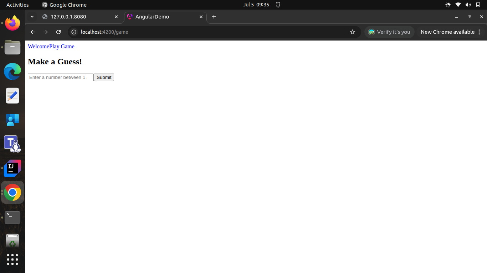

# guess-game-fe

This is a simple Flask-based API for a number guessing game. The server generates a random number between 1 and 10, and users can guess the number by sending POST requests to the `/guess` endpoint.

## Features

- Random number generation between 1 and 10.
- Tracks the number of attempts made by the user.
- Provides feedback on whether the guess is too high, too low, or correct.
- Resets the game after a correct guess.



## Requirements

- Python 3.x
- Flask
- Flask-CORS

## Installation

1. Clone the repository:
   ```sh
   git clone <repository-url>
   cd guess-game-be
   ```

1. Install the required Python packages:
   ```sh
   pip install flask flask-cors
   ```

1. Run the Flask application:
   ```sh
   python3 guess_game.py
   ```

