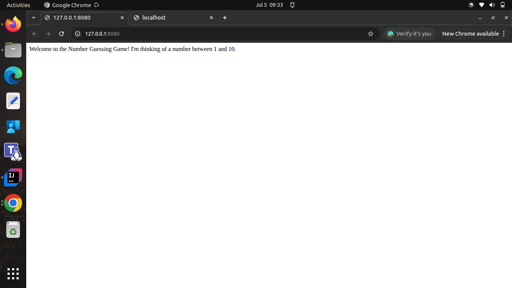

# guess-game-fe

This is the frontend part of a number guessing game application built with Angular. The frontend communicates with a backend API to handle game logic and user interactions.
This project was generated using [Angular CLI](https://github.com/angular/angular-cli) version 19.0.4.



# Prerequisite

Install [Node.js](https://nodejs.org/) and [Angular CLI](https://angular.dev/tools/cli) if you haven't already. You can check if they are installed by running:

```bash
node -v
ng version
```
# Getting Started

To get started with this Angular project, follow these steps:

## Clone the repository
```bash
git clone <repository-url>
cd guess-game-fe
```
## Install dependencies
```bash
npm install
```

## Running the application
To run the application in development mode, use the following command:

```bash
ng serve --open
```
        
This command will compile the application and open it in your default web browser. The application will be available at `http://localhost:4200/`.

## Code scaffolding

Angular CLI includes powerful code scaffolding tools. To generate a new component, run:

```bash
ng generate component component-name
```

For a complete list of available schematics (such as `components`, `directives`, or `pipes`), run:

```bash
ng generate --help
```

## Building

To build the project run:

```bash
ng build
```

This will compile your project and store the build artifacts in the `dist/` directory. By default, the production build optimizes your application for performance and speed.

## Running unit tests

To execute unit tests with the [Karma](https://karma-runner.github.io) test runner, use the following command:

```bash
ng test
```

## Running end-to-end tests

For end-to-end (e2e) testing, run:

```bash
ng e2e
```

Angular CLI does not come with an end-to-end testing framework by default. You can choose one that suits your needs.

## Additional Resources

For more information on using the Angular CLI, including detailed command references, visit the [Angular CLI Overview and Command Reference](https://angular.dev/tools/cli) page.
